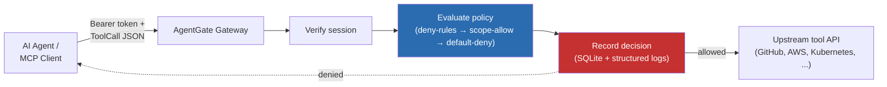

# AgentGate - Zero-trust policy gateway for AI agents & MCP servers.


**A zero-trust policy gateway for AI agents and MCP servers.**

AgentGate sits between an AI agent and the infrastructure it's allowed to touch. Every tool call gets a short-lived, scoped credential check, a policy decision, and an immutable audit entry — before anything is forwarded, not after.

[](https://github.com/umer-068/AgentGate/actions/workflows/ci.yml)
[](https://goreportcard.com/report/github.com/umer-068/AgentGate)
[](./LICENSE)
[](go.mod)

## Why

Autonomous AI agents and MCP-connected tools now call cloud APIs and internal systems directly, and it's one of the least-governed attack surfaces in most infrastructure today — standard IAM and secrets tooling wasn't designed for a principal that reasons and self-directs. AgentGate is a reference implementation of the missing governance layer: scoped credentials, policy-as-code enforcement, and a tamper-evident record of what every agent actually did.

## How it works



Full component architecture, sequence diagram, and the production-hardening roadmap live in [`docs/architecture.md`](./docs/architecture.md). The design rationale for the MVP's tech choices is in [`docs/adr/0001-go-over-rust-for-mvp.md`](./docs/adr/0001-go-over-rust-for-mvp.md).

## Quickstart

```bash
git clone https://github.com/umer-068/AgentGate.git && cd AgentGate
cp config.example.yaml config.yaml

# Signing key for session tokens - use a real secrets manager in production.
export AGENTGATE_SIGNING_KEY="$(openssl rand -base64 32)"

# Mint a 15-minute, read-only GitHub-scoped session token for a demo agent.
go run ./cmd/agentgate issue-token -config config.yaml \
  -agent demo-agent -scopes "tool:github:read"

# In another terminal: start the gateway.
go run ./cmd/agentgate serve -config config.yaml
```

Then call it as the agent would:

```bash
TOKEN="<token printed above>"

curl -s -X POST http://localhost:8443/v1/tool-call \
  -H "Authorization: Bearer $TOKEN" \
  -H "Content-Type: application/json" \
  -d '{"tool":"github","action":"read","resource":"repos/octocat/hello-world"}' | jq
```

A denied call — same agent, an action outside its granted scope:

```bash
curl -s -X POST http://localhost:8443/v1/tool-call \
  -H "Authorization: Bearer $TOKEN" \
  -H "Content-Type: application/json" \
  -d '{"tool":"github","action":"delete","resource":"repos/octocat/hello-world"}' | jq
# -> 403, decision.reason: "no matching allow rule"
```

And a call that no scope could ever unlock, because `internal/policy/policies/policy.yaml` denies it org-wide:

```bash
curl -s -X POST http://localhost:8443/v1/tool-call \
  -H "Authorization: Bearer $TOKEN" \
  -H "Content-Type: application/json" \
  -d '{"tool":"shell","action":"exec","resource":"rm -rf /"}' | jq
# -> 403, decision.policy_id: "explicit-deny"
```

## Policy model

Every decision is evaluated in a fixed order, and the first two are auditable independently of one another:

1. **Explicit deny rules** (`internal/policy/policies/policy.yaml`) are an org-wide ceiling — no agent scope can override them. This is the blast-radius control: even a wildcard-scoped agent can't touch a `prod-*` S3 bucket or invoke `shell` if a deny rule matches.
2. **Scope-based allow** — the agent's session token must carry a scope like `tool:github:read` (or `tool:github:*`) matching the requested call.
3. **Default deny** — anything not explicitly allowed is refused.

The same policy is expressed in real Rego at [`examples/policies/opa-reference/`](./examples/policies/opa-reference/) — the intended production evaluator; see the ADR for why v1 ships a native Go evaluator instead.

## Project layout

```
cmd/agentgate/         CLI entrypoint (serve, issue-token)
internal/config/       YAML config + env-var secret resolution
internal/identity/     Short-lived session token issuance & verification
internal/policy/       Policy evaluation (deny-rules → scope-allow → default-deny)
internal/audit/        Structured logs + append-only SQLite audit trail
internal/gateway/      HTTP handler wiring + upstream forwarding
pkg/mcp/                Public wire types (ToolCall, Decision, Result)
examples/policies/      Rego reference policy (production upgrade path)
deploy/docker/          Multi-stage Dockerfile
deploy/helm/            Helm chart
deploy/terraform/       SPIRE bootstrap roadmap
docs/                   Architecture doc + ADRs
```

Full annotated tree in [`docs/architecture.md`](./docs/architecture.md#modular-file-directory-structure).

## Development

```bash
make build      # compile ./cmd/agentgate
make test       # go test -race with coverage
make vet lint   # go vet + golangci-lint
make run        # run the gateway against config.example.yaml
make docker-build
make helm-lint
```

CI (`.github/workflows/ci.yml`) runs build/vet/test, `golangci-lint`, a Trivy scan on the built image, and `helm lint` on every push and pull request.

## Roadmap

| Component | Today (v1) | Production target |
|---|---|---|
| Workload identity | HMAC-JWT, CLI-issued | SPIFFE/SPIRE, auto-rotated |
| Policy engine | Native Go evaluator | OPA/Rego, bundle-signed |
| Audit trail | SQLite | ClickHouse + real-time dashboard |
| Anomaly detection | — | Isolation-forest sidecar on the audit stream |

See [`docs/architecture.md`](./docs/architecture.md#roadmap-swap-points-for-the-production-hardening-pass) for the full swap-point table — every one of these lands behind an existing interface in `internal/gateway`.

## License

[MIT](./LICENSE)
