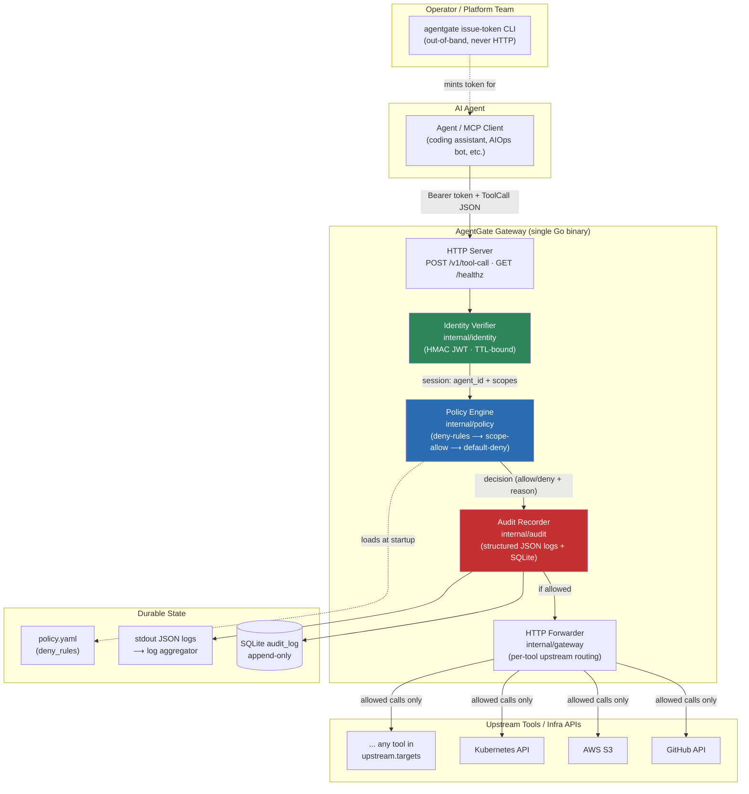
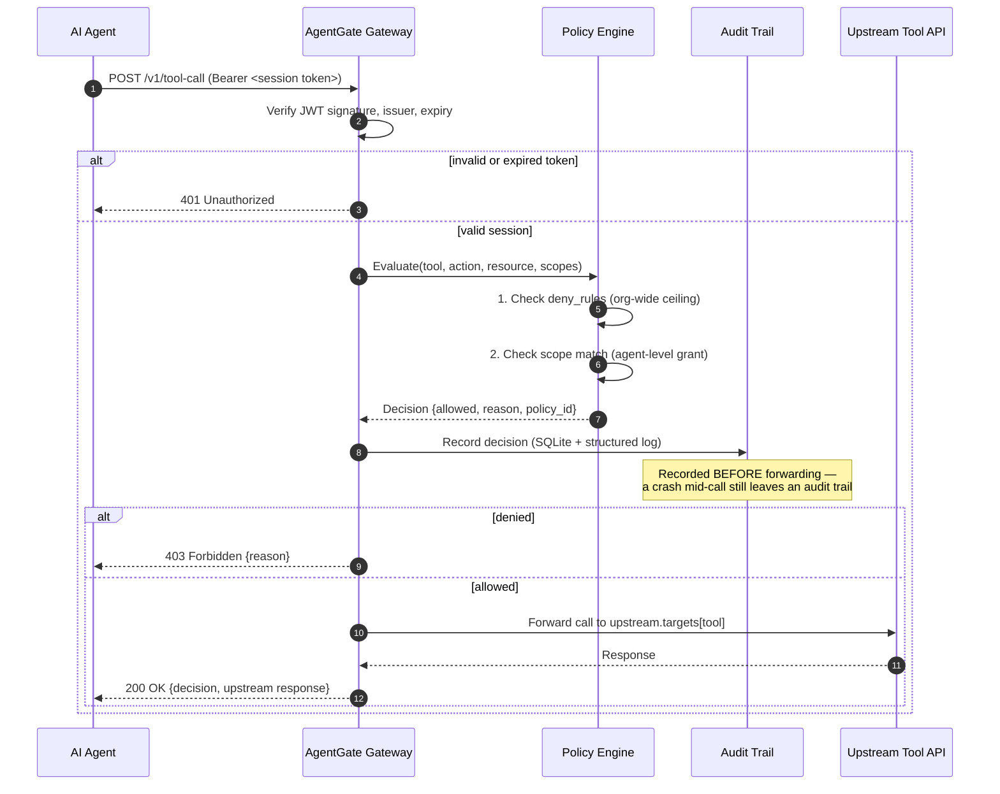

# AgentGate — System Architecture

AgentGate is a zero-trust policy gateway that sits between AI agents (MCP clients, autonomous AIOps agents, coding assistants) and the infrastructure they're allowed to touch. It issues short-lived scoped credentials, enforces policy-as-code on every tool call, and records an immutable audit trail — before any call is forwarded, not after.

This document describes the system as built (v1 MVP): a single Go binary, a native policy evaluator, and a SQLite-backed audit trail, with the swap points to production-grade replacements (SPIFFE/SPIRE, OPA/Rego, ClickHouse) documented at each boundary. See [`docs/adr/0001-go-over-rust-for-mvp.md`](./adr/0001-go-over-rust-for-mvp.md) for why the MVP is scoped this way.

## Component architecture & data flow



### Request lifecycle (every call, no exceptions)



## Design principles that drove the layout

1. **Deny before allow, always audited.** The policy engine checks org-wide `deny_rules` first — no agent scope can override them. Every decision, allowed or denied, is written to the audit trail *before* any upstream call is attempted (`internal/gateway/gateway.go:audit`), so a mid-request crash never produces an unaudited action.
2. **Token issuance is not an HTTP endpoint.** Minting a session credential is a CLI/operator action (`cmd/agentgate issue-token`), never a route on the gateway itself — an unauthenticated "give me a token" endpoint would defeat the purpose of a zero-trust gateway. In production this responsibility moves to a SPIFFE/SPIRE workload attestor.
3. **Policy is data, not code.** `internal/policy` loads `policy.yaml` at startup; changing what agents can do means editing the bundle, not redeploying the binary. The interfaces in `internal/gateway` (`PolicyEngine`, `TokenVerifier`, `AuditRecorder`, `Forwarder`) are the seams where the native MVP evaluator, HMAC issuer, and SQLite store get swapped for OPA/Rego, SPIFFE/SPIRE, and ClickHouse respectively, with zero change to the gateway's request-handling logic.
4. **Every collaborator is an interface.** `Gateway` depends on four small interfaces rather than concrete types, which is what makes `internal/gateway/gateway_test.go` able to fully exercise the allow/deny/error paths with in-memory fakes and no real network, disk, or crypto in the unit test suite.

## Modular file/directory structure

```
agentgate/
├── cmd/
│   └── agentgate/
│       └── main.go              # CLI entrypoint: `serve` and `issue-token` subcommands
│
├── internal/                    # Not importable outside this module — the gateway's implementation
│   ├── config/
│   │   ├── config.go             # YAML config loading + validation + env-var secret resolution
│   │   └── config_test.go
│   │
│   ├── identity/
│   │   ├── issuer.go             # Short-lived HMAC-JWT session issuance & verification
│   │   └── issuer_test.go        # (MVP stand-in for SPIFFE/SPIRE workload identity)
│   │
│   ├── policy/
│   │   ├── engine.go             # Native Go deny-then-scope policy evaluator
│   │   ├── engine_test.go
│   │   └── policies/
│   │       └── policy.yaml       # The actual runtime policy bundle (deny_rules)
│   │
│   ├── audit/
│   │   ├── logger.go             # Structured JSON stdout logger (log/slog)
│   │   ├── store.go              # Append-only SQLite audit trail (mattn/go-sqlite3)
│   │   └── store_test.go
│   │
│   └── gateway/
│       ├── gateway.go            # HTTP handler wiring: authn → policy → audit → forward
│       ├── gateway_test.go       # Full request-lifecycle tests against fakes
│       ├── forwarder.go          # HTTPForwarder: relays allowed calls to upstream.targets
│       └── forwarder_test.go
│
├── pkg/
│   └── mcp/
│       └── types.go              # Public wire types: ToolCall, Decision, Result
│                                  # (importable by anyone building an AgentGate client)
│
├── examples/
│   └── policies/
│       └── opa-reference/        # The SAME policy expressed in real Rego — the
│           ├── agent_policy.rego #   production-upgrade reference once OPA is wired in
│           └── data.json
│
├── deploy/
│   ├── docker/
│   │   └── Dockerfile            # Multi-stage build → distroless runtime image
│   ├── helm/
│   │   └── agentgate/            # Minimal Helm chart (Deployment, Service, ConfigMap)
│   └── terraform/
│       └── spire-bootstrap/      # Roadmap module: bootstraps a SPIRE server + agent
│
├── docs/
│   ├── architecture.md           # This document
│   └── adr/
│       └── 0001-go-over-rust-for-mvp.md
│
├── .github/
│   └── workflows/
│       └── ci.yml                # build → vet → test → lint → Trivy image scan
│
├── config.example.yaml
├── go.mod / go.sum
├── Makefile
└── README.md
```

## Roadmap: swap points for the production hardening pass

| Component | MVP (v1) | Production target | Swap boundary |
|---|---|---|---|
| Workload identity | HMAC-signed JWT, CLI-issued | SPIFFE/SPIRE, auto-rotated | `identity.Issuer` / `gateway.TokenVerifier` |
| Policy engine | Native Go evaluator, YAML rules | OPA/Rego, bundle-signed | `policy.Engine` / `gateway.PolicyEngine` |
| Audit trail | SQLite, single-node | ClickHouse, real-time dashboard | `audit.Store` / `gateway.AuditRecorder` |
| Anomaly detection | none (roadmap) | Python isolation-forest sidecar on the audit stream | new consumer of `audit.Store` |
| Transport | plain HTTP (TLS via ingress) | mTLS via SPIRE-issued certs | `cmd/agentgate` server setup |

Each swap is scoped to one package because `internal/gateway` depends only on the four interfaces, never on concrete types — this is the same design decision that makes the current test suite fast and dependency-free.
